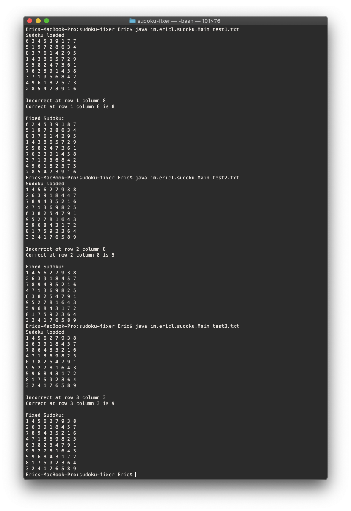
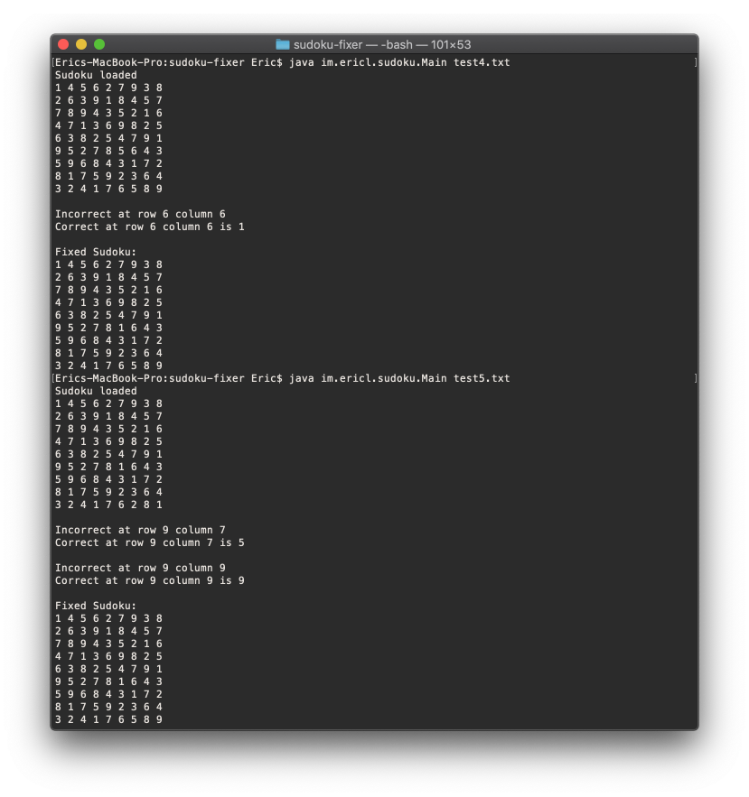
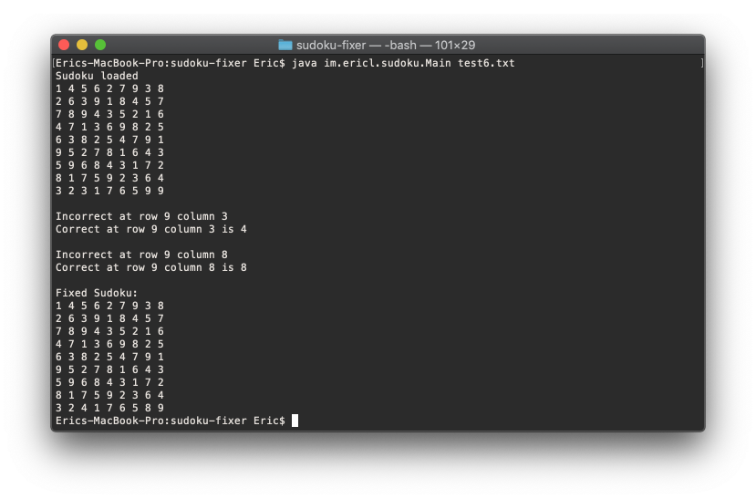

# sudoku-fixer
this application fixes sudoku grids

## usage
`cd out/production/sudoku-fixer`
`java im.ericl.sudoku.Main TEXT-FILE`

## example test file results

## how its made

### Threads
- Column checker thread
- Row checker thread
- Subgrid checker thread

all works basically the same. It will iterate 9 times, each according to its row/column/subgrid. Each thread will copy the inputted data for its likeness.
- subgrid will generate a 1d array containing all the subgrid numbers in order
- row will copy the row into a 1d array
- column will copy the column into a 1d array

they're all 1d array because the error will get noticed by either classes and all we have to check for is if a number from 1~9 is missing from the array.

all threads return an ArrayList containing 1d arrays of the error location: ` {error index, missing number} `

Back in main, it just reads off the error arraylist from each thread and prints them out.

At the end, it will replace the error locations with the correct numbers and print the fixed sudoku.

## stuff used
this uses Java and Java threads.

https://www.geeksforgeeks.org/intstream-anymatch-java-examples/

Uses Java8 lambda and IntStream operations.

## known shortcomings
if fed a sudoku file that is completely, just immeasurably wrong, then the program will not yield in expected results; it will not fully solve a sudoku for you. This program is a merely a fixer for minor errors.

This program does not have the most ideal runtime - after research, it seems that the lambda expressions supported in java8 is indeed helpful and convenient, but it's not performance friendly.

After making this, it seems that the subgrid checker is not that useful, because after all, you're just using rows and columns to fix or show the errors. It might be more accurate if all of the checks for a grid is done at once, and fixes the grid, and moves on to the next one - this will actually solve the sudoku in linear form.
